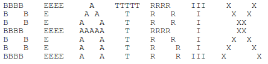
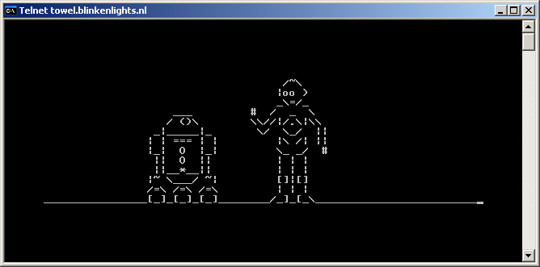

# ascii-art-assignment

In this assignment you will be using println to create formatted console output, including ASCII art.

## Set up
1. If you have not yet installed Processing on your Raspberry Pi you can do so by runing the following command in the terminal:  ```curl https://processing.org/download/install-arm.sh | sudo sh```
2. Fork the assignment.
3. Create an emtpy file for your code called ``ascii-art-assignment.pde``  if you are using Processing or ``ascii-art-assignment.java`` if you are using java. 
4. Add the program skeleton. If you are using Processing the skelton code is:
```
/**
 * <program/assignment name>
 * by <Your Name>
 * 
 * <Two sentence description of program>
 * 
 */
 
void setup() {
  
}

void draw() {

}
```
5. Commit and push/sync after adding/revising each new functional code chunk. Test run your program before each commit to make sure it runs and behaves the way it is supposed to.

To: Using escape characters is not required but may help you

\” - to print a quotation mark

\n - to create a new line

\t - to tab 3 spaces

\\\ - to print a backslash - this is needed for some ASCII art

## Part 1
Using the ```print`` (reference for ```print```: https://processing.org/reference/print_.html) and ``println`` (reference for ```println```: https://processing.org/reference/println_.html) constructs write code that console prints the first six letters of your first and/or last names so that it looks like the following example.  When ran, the letters must line up properly.



## Part 2
What is ASCII art? ASCII is the set of symbols (letters, punctuation marks and numbers) that make up the English language.  In the computer world, each of these ASCII symbols is assigned a number so that we can tell the computer what to print in binary.  For example: the capital letter P is represented by the number 80 which is 01010000 in binary. You do not need to know about binary or how ASCII works,... yet.  

Go to the site http://www.chris.com/ascii/ and look at some of the examples of ASCII art.  Then, write code to print a simple work of ASCII art. You can find one and copy it or make it up on your own. Your art should take between 10-15 and lines of code.  The code from Part 2 should be appended to the code file from Part 1. 


